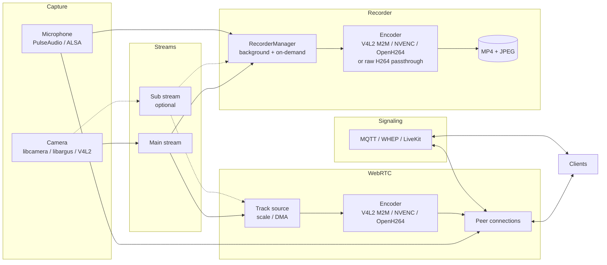

# Architecture

`pi-webrtc` is one process that pulls frames from a camera once and fans them out to three
consumers: the WebRTC encoder, the recorder, and — in the
[sponsor build](SPONSORS.md#sponsor-benefits) — the detector. Everything else is arranged
around avoiding a second copy of that frame.

## Capture

One capturer runs per camera, chosen by the `--camera` backend prefix — `LibcameraCapturer`,
`LibargusCapturer`, or `V4l2Capturer`. Audio comes from `PaCapturer` (PulseAudio) or
`AlsaCapturer` (`--force-alsa`).

When `--sub-width` and `--sub-height` are set, the camera produces a second, smaller stream
alongside the main one. `--webrtc-source` and `--record-source` then decide which consumer gets
which, so you can record at full resolution while streaming a downscaled copy, or vice versa.
See [Sub-stream](CONFIGURATION.md#sub-stream).

## WebRTC

`Conductor` owns the peer connection factory and the track sources. Which encoder is used
depends on `--hw-accel` and on the codecs the client offers — see
[Camera and Encoding](CAMERA_AND_ENCODING.md#encoding). With hardware acceleration, frames
move between decoder, scaler, and encoder as DMA buffers and never round-trip through the
CPU.

Each peer gets an `RtcChannel` DataChannel alongside its media, carrying snapshots, recording
control, file queries and transfers, camera controls, and — with `--enable-ipc` — arbitrary
application messages bridged to a local Unix socket.

## Recording

`RecorderManager` consumes the same frames the encoder does, so recording resolution is
unaffected by WebRTC's adaptive scaling. Up to two managers run at once: a background one
writing continuously to `--record-path`, and an on-demand one that clients start and stop over
the DataChannel. The concrete recorder depends on the source format and platform —
`RawH264Recorder` copies camera H264 straight into the container, while `V4L2H264Recorder`,
`JetsonRecorder`, and `OpenH264Recorder` encode. Audio is encoded to AAC by `AudioRecorder`
and muxed into the same MP4.

See [Recording](RECORDING.md).

## Signaling

`MqttService`, `WhepService` (WHEP), `LiveKitService` (SFU), and `CloudflareService` (SFU) all
implement the same `SignalingService` interface — `Connect()` and `Disconnect()` — and any
combination can run at once on a shared `boost::asio::io_context`. They only carry the SDP and
ICE exchange — once a peer connects, media and DataChannel traffic flow directly.

Peer bookkeeping belongs to each service rather than the interface. `MqttService` and
`WhepService` serve many independent clients, so they each hold a `PeerRegistry` that keys
peers by id and sweeps the expired ones; `LiveKitService` keeps the fixed publisher/subscriber
pair an SFU needs and no registry at all, and `CloudflareService` keeps a single publisher.
Every service reconnects on its own, so there is no lifecycle beyond connecting and tearing
down on destruction.

`CloudflareService` additionally talks to the device API (`--api-url`) over `HttpClient`: the
SFU handshake is relayed through it, and the session id Cloudflare assigns is published under
the device's uid so a viewer can find the stream. That second call is kept off the reconnect
path — the registry failing says nothing about a stream that is already flowing.

See [Signaling](SIGNALING.md).

## Platform

CMake detects the platform from `/etc/nv_tegra_release` or `/usr/bin/raspi-config` and
compiles in the matching capture and codec backends:

| | Raspberry Pi | Jetson |
|---|---|---|
| CSI capture | libcamera | libargus (EGL) |
| USB / legacy capture | V4L2 | V4L2 |
| Hardware codec | V4L2 M2M (`/dev/video10-12`), H264 | NVENC, H264 + AV1 |
| Software codec | OpenH264 + libyuv | OpenH264 + libyuv |
