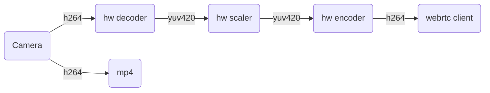
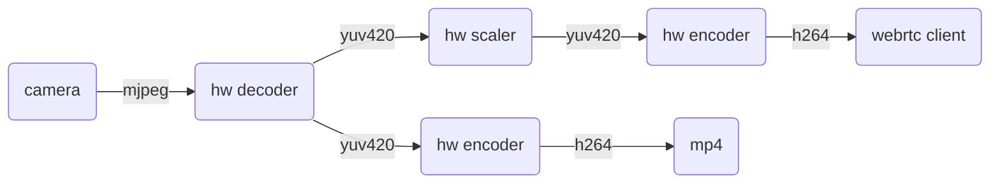
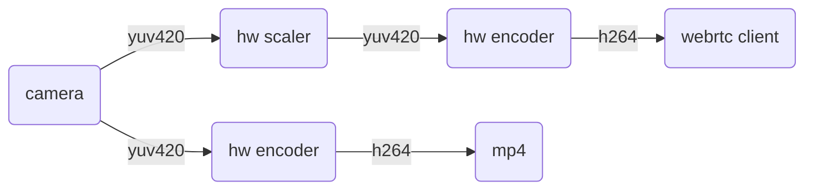
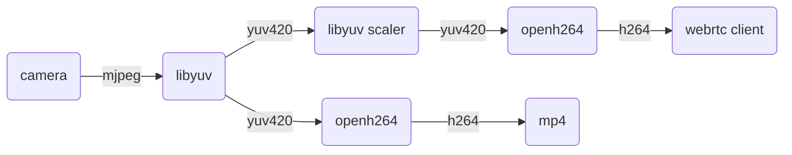
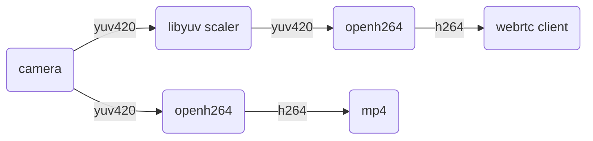

# Camera and Encoding

- [Camera Backends](#camera-backends)
  - [Libcamera](#libcamera)
  - [Libargus](#libargus)
  - [V4L2](#v4l2)
- [Encoding](#encoding)
  - [Hardware Encoding](#hardware-encoding)
  - [Software Encoding](#software-encoding)

## Camera Backends

`--camera` takes a `<backend>:<id>` string. Which backends exist depends on the platform the
binary was built for, which CMake detects from `/etc/nv_tegra_release` or `/usr/bin/raspi-config`.

| Backend | Value | Raspberry Pi | Jetson | Notes |
|---|---|:--:|:--:|---|
| Libcamera | `libcamera:<id>` | ✅ | ❌ | The officially recommended way to read a CSI camera on a Pi. |
| Libargus | `libargus:<id>` | ❌ | ✅ | NVIDIA's CSI camera stack, with EGL output. |
| V4L2 | `v4l2:<id>` | ✅ | ✅ | USB cameras, legacy CSI drivers, and V4L2 loopback devices. |

Asking for a backend the platform does not have is a startup error, e.g. `libcamera:0` on a
Jetson tells you to use `v4l2:<id>` instead.

### Libcamera

Keep the default `camera_auto_detect=1` in `/boot/firmware/config.txt`.

Libcamera only produces `yuv420` here, so `--v4l2-format` is ignored. Because `yuv420` is
uncompressed, the CSI/USB link — not the sensor — is usually what limits resolution and frame
rate. Each MIPI lane carries 1.5 Gbps on the Pi 5 and 1 Gbps on earlier models
[[ref](https://datasheets.raspberrypi.com/rpi5/raspberry-pi-5-product-brief.pdf)]:

| Interface | 1-lane MIPI (older Pi) | 2-lane MIPI (Pi 4) | 4-lane MIPI (Pi 5) | USB 2.0 | USB 3.0 |
|:--:|:--:|:--:|:--:|:--:|:--:|
| Bandwidth | 1 Gbps | 2 Gbps | 6 Gbps | 0.48 Gbps | 5 Gbps |

YUV 4:2:0 needs 12 bits per pixel, so 4Kp60 is `3840 × 2160 × 60 × 12` = 5.56 Gbps:

| Resolution | 4Kp60 | 4Kp30 | 1080p60 | 1080p30 |
|:--:|:--:|:--:|:--:|:--:|
| Bandwidth | 5.56 Gbps | 2.78 Gbps | 1.39 Gbps | 0.70 Gbps |

### Libargus

The CSI camera path on Jetson. Like libcamera it delivers `yuv420` and ignores
`--v4l2-format`, so the same bandwidth arithmetic applies. Frames arrive as EGL images and
stay on the GPU, which is what lets the encoder — and, in the
[commercial build](COMMERCIAL.md#licensing), the detector — read them without a copy through
the CPU.

```bash
/path/to/pi-webrtc --camera=libargus:0 --fps=30 --width=1920 --height=1080 ...
```

### V4L2

On a modern Raspberry Pi OS, USB cameras are picked up as V4L2 devices with no changes to
`config.txt`. For the legacy CSI driver, see [Advanced Usage](ADVANCED.md#using-the-legacy-v4l2-driver).

**1. Find the camera index.** List the V4L2 devices to get the `/dev/videoX` node:

```bash
v4l2-ctl --list-devices
```

**2. Check what it supports.** Query the pixel formats, resolutions, and frame rates, replacing
`X` with the index from step 1:

```bash
v4l2-ctl -d /dev/videoX --list-formats-ext
```

**3. Run with those values.** For a camera on `/dev/video2` doing YUYV 720p60:

```bash
/path/to/pi-webrtc --camera=v4l2:2 --v4l2-format=yuyv --fps=60 --width=1280 --height=720 ...
```

## Encoding

Which encoder WebRTC uses depends on `--hw-accel` and on the codecs the client offers in its
SDP. It is worth running `v4l2-ctl -d /dev/video0 --list-formats-ext` before choosing a source
format, since that decides which of the pipelines below you end up on.

### Hardware Encoding

With `--hw-accel`, `pi-webrtc` uses hardware video encoding when available.

| Platform                    | Hardware codecs   |
| --------------------------- | ----------------- |
| Raspberry Pi 3 / 4 / Zero 2 | H264 (V4L2 M2M)   |
| Raspberry Pi 5              | None              |
| NVIDIA Jetson               | H264, AV1         |

The client selects the codec during SDP negotiation. On Jetson, both H264 and AV1 are hardware-encoded; AV1 requires an Orin-generation module.

Recording uses the same hardware encoder when available. H264 sources can be recorded directly, while other formats are re-encoded as needed. Without hardware encoding, recording falls back to OpenH264.

On platforms without hardware encoding, `--hw-accel` automatically falls back to software encoding.

#### `h264` camera source

```bash
/path/to/pi-webrtc --camera=v4l2:0 --v4l2-format=h264 --fps=30 --width=1280 --height=960 --hw-accel ...
```



The `h264` stream is taken straight from the camera and decoded to `yuv420` in hardware. When
WebRTC detects network or device pressure the hardware scaler drops the decoded frame
resolution, and raises it again when conditions improve; the encoder is reset to match each
time. All frames move between the codecs over DMA, with no copy. If recording is enabled, the
camera's `h264` packets are copied into the MP4 directly, without re-encoding.

#### `mjpeg` camera source

```bash
/path/to/pi-webrtc --camera=v4l2:0 --v4l2-format=mjpeg --fps=30 --width=1280 --height=960 --hw-accel ...
```



Same as above, except that there are no `h264` packets to copy, so the recorder runs its own
hardware encoder instance on the decoded frames.

#### `i420` camera source

```bash
# V4L2 camera
/path/to/pi-webrtc --camera=v4l2:0 --v4l2-format=i420 --fps=30 --width=1280 --height=960 --hw-accel ...

# Libcamera
/path/to/pi-webrtc --camera=libcamera:0 --fps=30 --width=1280 --height=960 --hw-accel ...

# Libargus (Jetson)
/path/to/pi-webrtc --camera=libargus:0 --fps=30 --width=1280 --height=960 --hw-accel ...
```



The camera delivers uncompressed `yuv420`, so check the [bandwidth tables](#libcamera) before
asking for high resolution and frame rate together. This path is useful on a Pi Zero, or when
CPU is already spoken for by other services. Recording runs its own hardware encoder instance
on the same frames.

### Software Encoding

Without `--hw-accel`, `pi-webrtc` advertises `H264`, `VP8`, `VP9`, and `AV1`, and the client's
SDP picks the winner. If you need a specific codec, make sure the client offers only that one.

#### `h264` camera source

Not supported — there is no H264 software decoder in `pi-webrtc`.

#### `mjpeg` camera source

```bash
/path/to/pi-webrtc --camera=v4l2:0 --v4l2-format=mjpeg --fps=30 --width=1280 --height=960 ...
```



The usual choice for devices without a V4L2 hardware encoder. `libyuv` decodes the `mjpeg`
frames to `yuv420` and handles downscaling when WebRTC asks for a lower resolution. Recording
runs on its own `OpenH264` instance.

#### `i420` camera source

```bash
# V4L2 camera
/path/to/pi-webrtc --camera=v4l2:0 --v4l2-format=i420 --fps=30 --width=1280 --height=960 ...

# Libcamera
/path/to/pi-webrtc --camera=libcamera:0 --fps=30 --width=1280 --height=960 ...
```



For devices with no hardware encoder but plenty of CSI/USB bandwidth.
