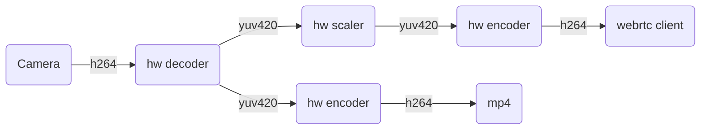
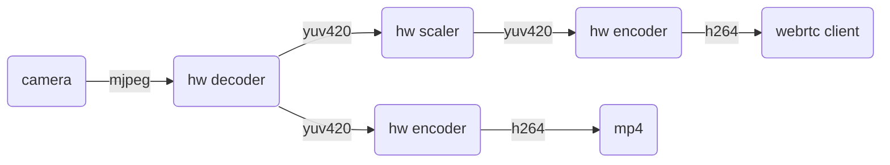
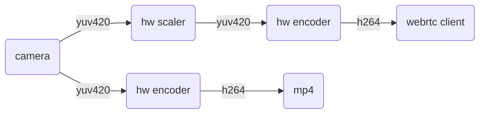
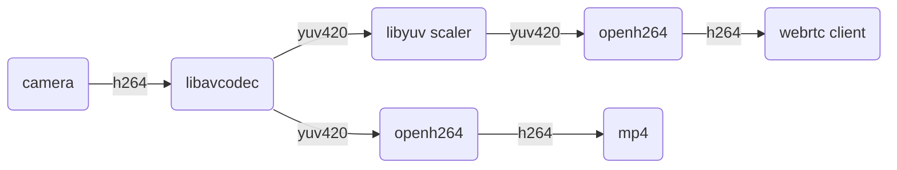
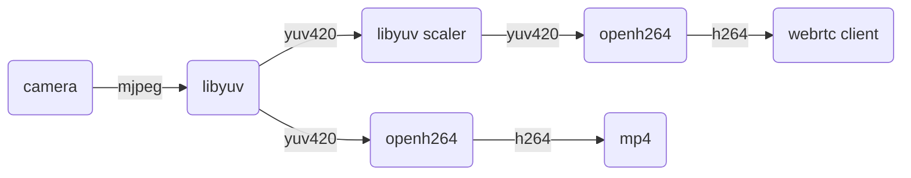
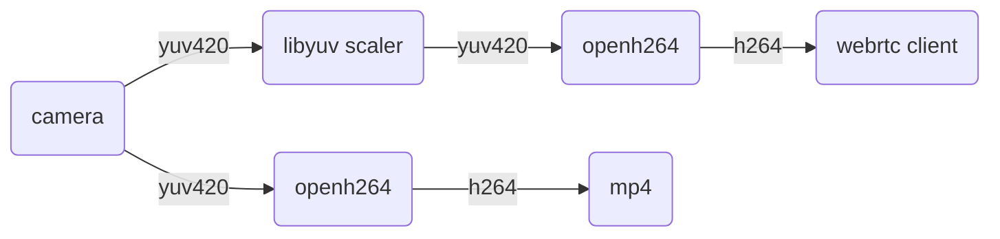

# Encoding

- [Hardware Encoding](#hardware-encoding)
- [Software Encoding](#software-encoding)

Which encoder WebRTC uses depends on `--hw-accel` and on the codecs the client offers in its
SDP. It is worth running `v4l2-ctl -d /dev/video0 --list-formats-ext` before choosing a source
format, since that decides which of the pipelines below you end up on. See [Camera](CAMERA.md)
for the backends and their formats.

## Hardware Encoding

With `--hw-accel`, `pi-webrtc` uses hardware video encoding when available.

| Platform                    | Hardware codecs   |
| --------------------------- | ----------------- |
| Raspberry Pi 3 / 4 / Zero 2 | H264 (V4L2 M2M)   |
| Raspberry Pi 5              | None              |
| NVIDIA Jetson               | H264, AV1         |

The client selects the codec during SDP negotiation. On Jetson, both H264 and AV1 are hardware-encoded; AV1 requires an Orin-generation module.

Recording re-encodes the frames the camera delivers, using the same hardware encoder when available and OpenH264 otherwise. To keep a camera's own `h264` stream untouched, record it outside `pi-webrtc`, for example through a [MediaMTX](https://github.com/bluenviron/mediamtx) proxy.

With `--hw-accel`, each hardware decoder, scaler, and encoder that the board lacks falls back to its software counterpart on its own, with a warning in the log. On a Pi 5, for example, encoding is done in software.

### `h264` camera source

```bash
/path/to/pi-webrtc --camera=v4l2:0 --v4l2-format=h264 --fps=30 --width=1280 --height=960 --hw-accel ...
```



The `h264` stream is taken straight from the camera and decoded to `yuv420` in hardware. When
WebRTC detects network or device pressure the hardware scaler drops the decoded frame
resolution, and raises it again when conditions improve; the encoder is reset to match each
time. All frames move between the codecs over DMA, with no copy. If recording is enabled, the
recorder runs its own hardware encoder instance on the decoded frames.

### `mjpeg` camera source

```bash
/path/to/pi-webrtc --camera=v4l2:0 --v4l2-format=mjpeg --fps=30 --width=1280 --height=960 --hw-accel ...
```



Same as above, with the camera compressing to `mjpeg` instead of `h264`.

### `i420` camera source

```bash
# V4L2 camera
/path/to/pi-webrtc --camera=v4l2:0 --v4l2-format=i420 --fps=30 --width=1280 --height=960 --hw-accel ...

# Libcamera
/path/to/pi-webrtc --camera=libcamera:0 --fps=30 --width=1280 --height=960 --hw-accel ...

# Libargus (Jetson)
/path/to/pi-webrtc --camera=libargus:0 --fps=30 --width=1280 --height=960 --hw-accel ...
```



The camera delivers uncompressed `yuv420`, so check the [bandwidth tables](CAMERA.md#libcamera) before
asking for high resolution and frame rate together. This path is useful on a Pi Zero, or when
CPU is already spoken for by other services. Recording runs its own hardware encoder instance
on the same frames.

## Software Encoding

Without `--hw-accel`, `pi-webrtc` advertises `H264`, `VP8`, `VP9`, and `AV1`, and the client's
SDP picks the winner. If you need a specific codec, make sure the client offers only that one.

### `h264` camera source

```bash
/path/to/pi-webrtc --camera=v4l2:0 --v4l2-format=h264 --fps=30 --width=1280 --height=720 ...
```



Without a hardware decoder, `libavcodec` decodes the `h264` stream in software. A Pi 5 takes
about 6 ms per 1080p frame on one core.

### `mjpeg` camera source

```bash
/path/to/pi-webrtc --camera=v4l2:0 --v4l2-format=mjpeg --fps=30 --width=1280 --height=960 ...
```



The usual choice for devices without a V4L2 hardware encoder. `libyuv` decodes the `mjpeg`
frames to `yuv420` and handles downscaling when WebRTC asks for a lower resolution. Recording
runs on its own `OpenH264` instance.

### `i420` camera source

```bash
# V4L2 camera
/path/to/pi-webrtc --camera=v4l2:0 --v4l2-format=i420 --fps=30 --width=1280 --height=960 ...

# Libcamera
/path/to/pi-webrtc --camera=libcamera:0 --fps=30 --width=1280 --height=960 ...
```



For devices with no hardware encoder but plenty of CSI/USB bandwidth.
