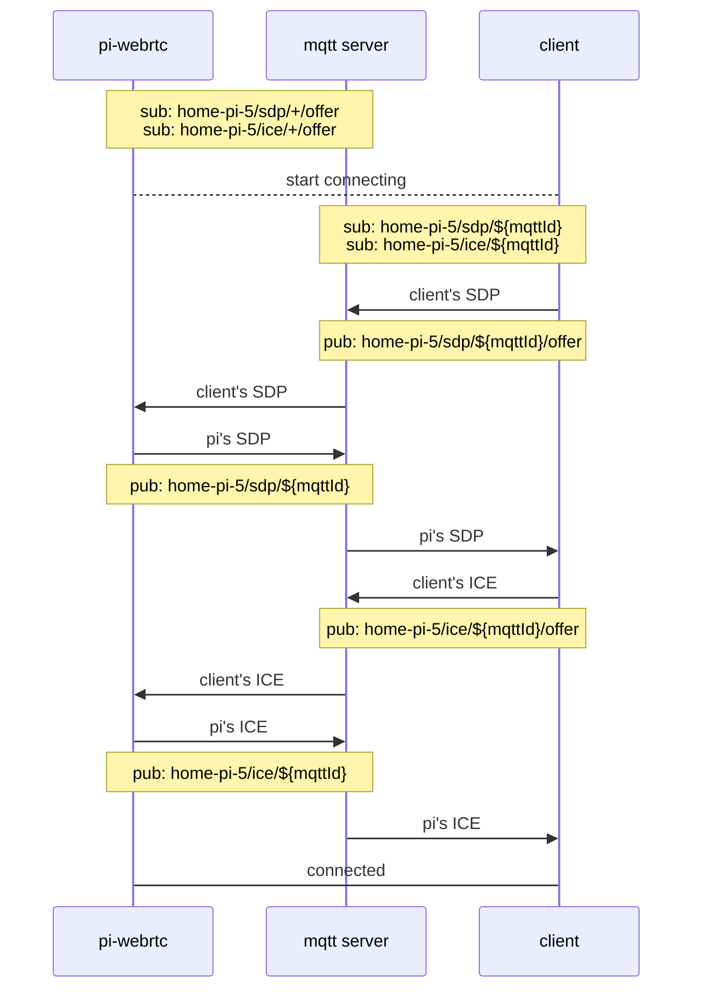

# Signaling

Before two WebRTC peers can send media they have to exchange an SDP offer/answer and a set of
ICE candidates. `pi-webrtc` can do that over three transports, and more than one can be
enabled at a time. If none is enabled the process exits — there would be no way to reach it.

| Transport | Needs | Good for |
|---|---|---|
| [MQTT](#mqtt) | MQTT broker | P2P viewing from anywhere without a public hostname |
| [WHEP](#whep) | HTTP port | Standard WebRTC player |
| [SFU](#sfu) | LiveKit server, or Cloudflare Realtime | Many simultaneous viewers |

All three are configured in [Configuration](CONFIGURATION.md#signaling).

## MQTT


`pi-webrtc` registers with the broker at startup and waits for a client to start the
handshake. Use [HiveMQ](https://www.hivemq.com), [EMQX](https://www.emqx.com/en), or a
[self-hosted broker](SETUP_MOSQUITTO.md).

```bash
/path/to/pi-webrtc --camera=libcamera:0 \
  --fps=30 \
  --width=1280 \
  --height=960 \
  --use-mqtt \
  --mqtt-host=your.mqtt.cloud \
  --mqtt-port=8883 \
  --mqtt-username=hakunamatata \
  --mqtt-password=Wonderful \
  --uid=home-pi-5 \
  --no-audio
```

Topics are namespaced by `--uid`. Below, `--uid=home-pi-5` and `${mqttId}` is a random id the
client generates to identify its own connection, so several clients can talk to one device at
once.



Clients:
- [client-sdk-js](https://github.com/mazupo/client-sdk-js)
- [picamera-web](https://app.mazupo.com) (Web demo)
- [picamera-app](https://github.com/TzuHuanTai/picamera-app) (Android demo)

## WHEP


Play WebRTC streams directly using a standard WHEP URL, with no third-party broker or registration.

```bash
/path/to/pi-webrtc --camera=libcamera:0 \
  --fps=30 \
  --width=1280 \
  --height=960 \
  --use-whep \
  --whep-port=8080 \
  --uid=home-pi-5 \
  --no-audio
```

Clients:
- [Home Assistant WebRTC Camera](https://github.com/AlexxIT/WebRTC) (see [using-the-webrtc-camera-in-home-assistant](ADVANCED.md#using-the-webrtc-camera-in-home-assistant)) 
- [eyevinn/webrtc-player](https://www.npmjs.com/package/@eyevinn/webrtc-player) (see [WHEP with webrtc-player](ADVANCED.md#whep-with-webrtc-player))

## SFU


With MQTT or WHEP, each viewer connects directly to the device. More viewers means more connections, bandwidth, and encoding load on the device.

An SFU lets the device send the stream once. The SFU forwards it to all viewers, making it much easier to support many viewers without overloading the device. See [broadcasting to many viewers](ADVANCED.md#broadcasting-a-live-stream-to-many-viewers-via-sfu) for a worked example.

Supported SFU backends:
- [LiveKit](https://livekit.com/) — self-hosted, or LiveKit cloud.
- [Cloudflare Realtime](https://www.cloudflare.com/products/realtime/) — fully managed by Cloudflare.

Client: 
- [client-sdk-js](https://github.com/mazupo/client-sdk-js)
- [livekit-sdk](https://github.com/livekit/client-sdk-js)

