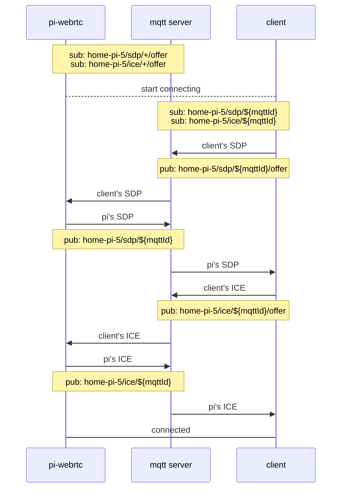
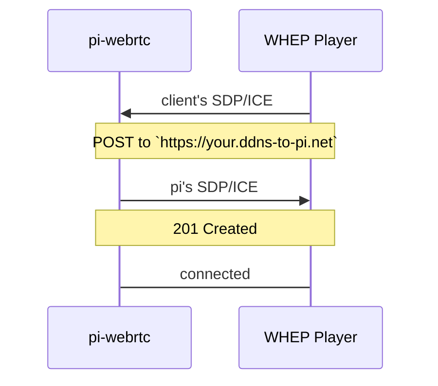
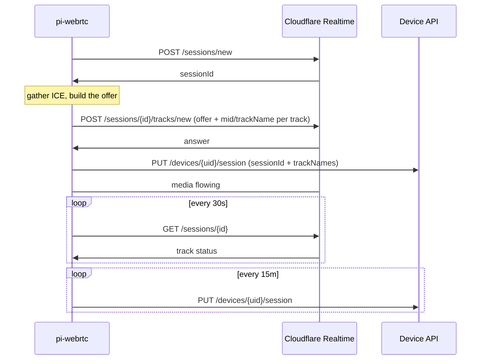

# Signaling

Before two WebRTC peers can send media they have to exchange an SDP offer/answer and a set of
ICE candidates. `pi-webrtc` can do that over three transports, and more than one can be
enabled at a time. If none is enabled the process exits — there would be no way to reach it.

| Transport | Needs | Good for |
|---|---|---|
| [MQTT](#mqtt) | An MQTT broker | Peer-to-peer viewing from anywhere, no public hostname |
| [WHEP](#whep) | A public hostname with TLS | Playing a URL in a standard WebRTC player |
| [SFU](#sfu) | A LiveKit server, or a Cloudflare Realtime app | Many simultaneous viewers |

All three are configured in [Configuration](CONFIGURATION.md#signaling).

## MQTT


`pi-webrtc` registers with the broker at startup and waits for a client to start the
handshake. Use [HiveMQ](https://www.hivemq.com), [EMQX](https://www.emqx.com/en), or a
[self-hosted broker](SETUP_MOSQUITTO.md).

```bash
/path/to/pi-webrtc --camera=libcamera:0 \
  --fps=30 \
  --width=1280 \
  --height=960 \
  --use-mqtt \
  --mqtt-host=your.mqtt.cloud \
  --mqtt-port=8883 \
  --mqtt-username=hakunamatata \
  --mqtt-password=Wonderful \
  --uid=home-pi-5 \
  --no-audio
```

Topics are namespaced by `--uid`. Below, `--uid=home-pi-5` and `${mqttId}` is a random id the
client generates to identify its own connection, so several clients can talk to one device at
once.



Clients:
[client-sdk-js](https://github.com/mazupo/client-sdk-js) ·
[picamera-web](https://app.picamera.live) ·
[picamera-app](https://github.com/TzuHuanTai/picamera-app) (Android)

## WHEP


No broker and no registration — the client POSTs its SDP to a URL and gets one back, so the
stream plays from a plain URL much like RTSP or RTMP.

```bash
/path/to/pi-webrtc --camera=libcamera:0 \
  --fps=30 \
  --width=1280 \
  --height=960 \
  --use-whep \
  --http-port=8080 \
  --uid=home-pi-5 \
  --no-audio
```



Browsers only allow WebRTC from pages served over `https`, so in practice this needs a TLS
certificate in front of it — see [WHEP with an Nginx proxy](ADVANCED.md#whep-with-nginx-proxy).

Clients:
[Home Assistant WebRTC Camera](https://github.com/AlexxIT/WebRTC) (see
[the setup guide](ADVANCED.md#using-the-webrtc-camera-in-home-assistant)) ·
[eyevinn/webrtc-player](https://www.npmjs.com/package/@eyevinn/webrtc-player)

## SFU


MQTT and WHEP both give every viewer their own peer connection with the device, which the
device's uplink and encoder can only stretch so far. A **SFU** (Selective Forwarding Unit)
takes a single stream from the device and fans it out, so viewer count stops being the
device's problem. See [Broadcasting to many viewers](ADVANCED.md#broadcasting-a-live-stream-to-many-viewers-via-sfu)
for a worked example.

Two backends implement it: [LiveKit](#livekit), an SFU you host yourself, and
[Cloudflare Realtime](#cloudflare-realtime), a managed one running on Cloudflare's edge.

### LiveKit

```bash
/path/to/pi-webrtc --camera=libcamera:0 \
    --fps=30 \
    --width=1920 \
    --height=1080 \
    --uid=your-display-name \
    --use-livekit \
    --livekit-url=wss://your-sfu-host.example.com \
    --livekit-key=your-api-key \
    --livekit-room=the-room-name
```

The device opens a WebSocket to `/rtc` on the SFU, passing `--livekit-key`, `--livekit-room`, and
`--uid` as the API key, room, and publisher identity. The `--livekit-url` scheme selects TLS
(`wss://` or `ws://`), and the port defaults to `443` for `wss` and `80` otherwise unless the
URL spells one out, e.g. `ws://127.0.0.1:7880`. The SFU replies with the ICE servers to use,
and the usual offer/answer follows over that socket, including renegotiation when tracks
change.

Everyone who joins the same room sees the stream. With `--enable-ipc`, DataChannel messages
are broadcast to every participant in the room rather than to a single peer.

Client: [client-sdk-js](https://github.com/mazupo/client-sdk-js)

#### Access Tokens <sup>[\*](COMMERCIAL.md#licensing)</sup>

The [commercial version](COMMERCIAL.md#licensing) can connect to a LiveKit server directly,
signing its own access token on-device from an API key/secret pair (`--livekit-secret`) each
time it connects.

### Cloudflare Realtime

Publishes into a [Cloudflare Realtime](https://developers.cloudflare.com/realtime/sfu/) app,
so nothing has to be hosted and the fan-out runs on Cloudflare's edge.

```bash
/path/to/pi-webrtc --camera=libcamera:0 \
    --fps=30 \
    --width=1920 \
    --height=1080 \
    --uid=your-display-name \
    --use-cloudflare \
    --api-url=https://api.picamera.live \
    --api-key=your-device-api-key
```

No Cloudflare credentials ever reach the device. Every call goes to `<api-url>/sfu/...`, which
attaches the Realtime credentials and forwards the request. That is what makes SFU streaming
usable without a Cloudflare account of your own — [api.picamera.live](https://api.picamera.live)
exists so the feature can be tried for free — and it means a stolen device yields a revocable API
key rather than full access to an app. The session id is published under the uid, so a viewer
only ever needs that — see [Finding the stream](#finding-the-stream) below.

#### Your own Realtime app <sup>[\*](COMMERCIAL.md#licensing)</sup>

The [commercial version](COMMERCIAL.md#licensing) carries the handshake itself, so it can publish
into a Realtime app of your own from an App ID/Secret pair (`--cloudflare-app-id`,
`--cloudflare-app-secret`) with no relay in between.

#### The exchange

Cloudflare has no signaling socket — the whole exchange is a handful of HTTPS calls against
`https://rtc.live.cloudflare.com/v1/apps/<app-id>`, authenticated with the App Secret as a
bearer token. The device never makes them itself: it calls `<api-url>/sfu/...` and the device API
attaches the credentials and forwards. The sequence is the same either way:



There is no trickle-ICE endpoint, so candidates are gathered before the offer goes out. A
Cloudflare session is tied to one PeerConnection, so when the link drops the device mints a
brand-new session and republishes, backing off from 1s up to 30s between attempts.

#### Finding the stream

Subscribers pull a track by its **sessionId** and **trackName**. Track names come from the camera
and are stable across reconnects — `video_track`, `video_track_<alias>` when a camera has an
alias, and `audio_track` — but Cloudflare picks the session id and mints a new one on every
reconnect, so nothing on the subscriber side can derive it.

The device publishes both under its `--uid` as soon as Cloudflare accepts the offer, and
refreshes every 15 minutes so the record expires on its own if the device goes away. A viewer
then only ever needs the uid.

Both are logged as well, which is the only surface for a build running without a device API.
Handing the session id to something local over IPC instead is on the roadmap, so a deployment
that wants neither Cloudflare KV nor a hosted service still has a way out:

```
Publishing to Cloudflare session 0c7a2e2f353b4433f90f434fa2801f31...
  track audio_track (mid 0)
  track video_track (mid 1)
```

A failed report is logged and retried with backoff; it never disturbs a stream that is already
flowing. The session can also be read straight from the
[Cloudflare API](https://developers.cloudflare.com/realtime/sfu/https-api/).

DataChannel/IPC traffic is not carried over this backend — `--enable-ipc` still applies to the
other signaling services running alongside it.

Client: [client-sdk-js](https://github.com/mazupo/client-sdk-js)

---

# Commercial Version

Options marked <sup>[\*](COMMERCIAL.md#licensing)</sup> above are part of the commercial
build. See [Commercial Version](COMMERCIAL.md) for what is included and how to license it.
