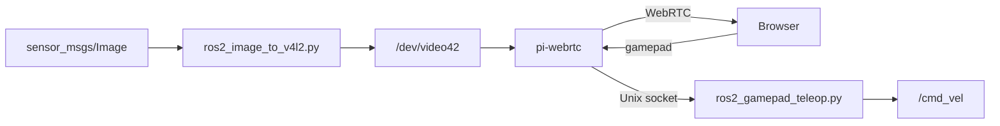

# ROS

Stream a ROS 2 image topic to the browser with pi-webrtc, and drive the robot with a gamepad from the same browser.



## Before you start

- You need ROS 2 Humble or newer, on Ubuntu or a Jetson. Raspberry Pi OS has no official ROS 2 packages. On a Raspberry Pi, use Ubuntu, or run ROS 2 in Docker.
- pi-webrtc runs on the same device as ROS. If ROS runs on another computer, see [ROS on another computer](#ros-on-another-computer).
- Install OpenCV for Python: `sudo apt install python3-opencv`.

## 1. Create a virtual camera

```bash
sudo apt install v4l2loopback-dkms
sudo modprobe -r v4l2loopback
sudo modprobe v4l2loopback devices=1 video_nr=42 card_label=RosCam max_buffers=4 exclusive_caps=1
```

This creates `/dev/video42`. The `modprobe -r` command first removes an old virtual camera, if there is one. See [Virtual cameras](../media/virtual-camera.md) for more about it.

## 2. Write the image topic to it

The [ros2_image_to_v4l2.py](../../examples/ros2_image_to_v4l2.py) example subscribes to an image topic. It resizes each frame and writes it to the virtual camera:

```bash
source /opt/ros/humble/setup.bash
python3 examples/ros2_image_to_v4l2.py --topic /image --device /dev/video42 --width 1280 --height 720
```

It reads the encodings `bgr8`, `rgb8`, `bgra8`, `rgba8`, `mono8`, `yuv422_yuy2` and `yuv422`. It does not need `cv_bridge`, which fails on machines with NumPy 2.

No camera yet? Publish a test image on `/image`:

```bash
ros2 run image_tools cam2image --ros-args -p burger_mode:=true -p frequency:=30.0
```

## 3. Stream it

Start pi-webrtc after the example is running and receiving images:

```bash
./pi-webrtc --camera=v4l2:42 --v4l2-format=i420 --width=1280 --height=720 --fps=30 --uid=my-robot --no-audio --use-whep
```

Use the same size as in step 2. Then watch it like any other camera. See [Getting Started](../getting-started/README.md#choose-your-device) for the player.

If pi-webrtc or the example fails with `Device or resource busy` or `Invalid argument`, see [Virtual cameras: Troubleshooting](../media/virtual-camera.md#troubleshooting).

## Drive the robot with a gamepad

pi-webrtc sends the browser's gamepad state to a Unix socket on the device. The [ros2_gamepad_teleop.py](../../examples/ros2_gamepad_teleop.py) example reads it, and publishes `geometry_msgs/Twist` on `/cmd_vel`.

1. Start pi-webrtc with `--enable-gamepad`. The gamepad state travels over a DataChannel, so use [MQTT](../signaling/mqtt.md) or LiveKit, not WHEP:

    ```bash
    ./pi-webrtc --camera=v4l2:42 --v4l2-format=i420 --width=1280 --height=720 --fps=30 \
        --uid=my-robot --no-audio \
        --use-mqtt --mqtt-host=xxxxxxxx.ala.us-east-1.emqxsl.com --mqtt-port=8883 \
        --mqtt-username=your-username --mqtt-password=your-password \
        --enable-gamepad
    ```

2. Run the example:

    ```bash
    source /opt/ros/humble/setup.bash
    python3 examples/ros2_gamepad_teleop.py --max-linear 0.5 --max-angular 1.0
    ```

3. Open [app.mazupo.com/gamepad](https://app.mazupo.com/gamepad), connect to the robot, and plug a gamepad into your computer.

4. Hold the right bumper (`rb`) and move the left stick. Push it up to drive forward, and left or right to turn.

To see the commands, run `ros2 topic echo /cmd_vel`.

The robot stops when:

- you let go of `rb`. Choose another button with `--deadman`.
- the gamepad sends nothing for 500 ms, for example when the browser tab is in the background.
- pi-webrtc stops, or the network connection drops.

Test with the wheels off the ground first.

| Option | Default | Description |
| --- | --- | --- |
| `--socket` | `/tmp/pi-webrtc-gamepad.sock` | pi-webrtc's `--gamepad-socket-path` |
| `--topic` | `/cmd_vel` | The `geometry_msgs/Twist` topic to publish |
| `--max-linear` | `0.5` | Forward speed at full stick, in m/s |
| `--max-angular` | `1.0` | Turn speed at full stick, in rad/s |
| `--deadman` | `rb` | The button to hold while driving. `""` drives without one. |
| `--gamepad` | first gamepad | Which gamepad to follow, by its key. See [Gamepad](gamepad.md#snapshots). |
| `--rate` | `20` | How often to publish, in Hz |

## Why a virtual camera, not RTSP

With a virtual camera, the video is encoded once, on the device that streams it. With RTSP, the video is encoded to H.264, decoded again by pi-webrtc, and then encoded again for WebRTC.

## ROS on another computer

Then the video must cross the network anyway, so RTSP is the better choice:

1. On the ROS computer, publish the image topic as an RTSP stream to [MediaMTX](https://github.com/bluenviron/mediamtx), for example with a GStreamer or `ffmpeg` pipeline.
2. On the pi-webrtc device, read it as described in [RTSP cameras](../media/rtsp.md).

If you do not need adaptive video or DataChannels, MediaMTX's own WebRTC output is enough.
