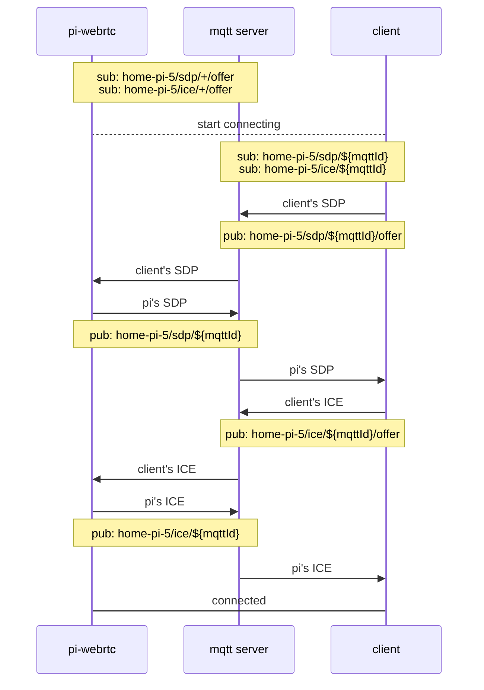

# MQTT

Watch the camera from anywhere, without a public IP address or port forwarding. The device and the browser exchange connection details through an MQTT broker. The video itself goes directly between them (peer-to-peer).


This guide assumes that WHEP already works for you. If not, start with [Getting Started](../getting-started/README.md).

## 1. Get an MQTT broker

Choose one:

- **[EMQX Serverless](https://www.emqx.com/en/cloud/serverless-mqtt):** a free plan, with nothing to host. The free quota keeps about 23 devices online all month. Create a **Serverless** deployment, and add a user under **Access Control** > **Authentication**. The **Overview** page shows the broker address.
- **[Self-hosted Mosquitto](mosquitto.md):** run your own broker.
- **[AWS IoT Core](https://aws.amazon.com/iot-core/):** another cloud broker with a free tier. pi-webrtc logs in with a username and password, so AWS IoT Core needs a [custom authorizer](https://docs.aws.amazon.com/iot/latest/developerguide/custom-authentication.html) for it.
- **Any other MQTT broker** with TLS and secure WebSocket.

The device and the browser use **different ports**:

| Who connects | Protocol | Port on EMQX Serverless |
|---|---|---|
| pi-webrtc on the device | MQTT over TLS | `8883` |
| The browser | MQTT over secure WebSocket, path `/mqtt` | `8084` |

## 2. Start pi-webrtc with MQTT

Use the camera option from your [getting started](../getting-started/README.md) guide. For a CSI camera on a Raspberry Pi:

```bash
./pi-webrtc \
    --camera=libcamera:0 \
    --width=1280 --height=720 --fps=30 \
    --uid=my-pi \
    --no-audio \
    --hw-accel \
    --use-mqtt \
    --mqtt-host=xxxxxxxx.ala.us-east-1.emqxsl.com \
    --mqtt-port=8883 \
    --mqtt-username=your-username \
    --mqtt-password=your-password
```

The device is ready when the log shows `MQTT connected to broker` and then `MQTT service is ready.`

## 3. Connect from the browser

Open the [web app](https://app.mazupo.com) and fill in:

| Field | Value |
|---|---|
| Host | The broker host, the same as `--mqtt-host` |
| Path | `/mqtt` |
| Port | The broker's **WebSocket** port (`8084` on EMQX Serverless), not `8883` |
| Username / Password | The same broker login |
| uid | Exactly the value of `--uid` |

Several browsers can connect to one device at the same time.

## Keep the uid private

`--uid` is any name that you choose. It is part of every MQTT topic, so the browser must use exactly the same value. Anyone who knows the uid and the broker login can reach the device.

## Other clients

- [client-sdk-js](https://github.com/mazupo/client-sdk-js): build your own web or React Native app.
- [picamera-app](https://github.com/TzuHuanTai/picamera-app): an Android app.

## How it works

Every topic starts with the `--uid`. In this example, `--uid=home-pi-5`. `${mqttId}` is a random id that each client creates, so several clients can talk to one device at once.



## Problems?

See [Troubleshooting](../getting-started/troubleshooting.md). Over 4G or 5G, you may also need [TURN](turn.md).
